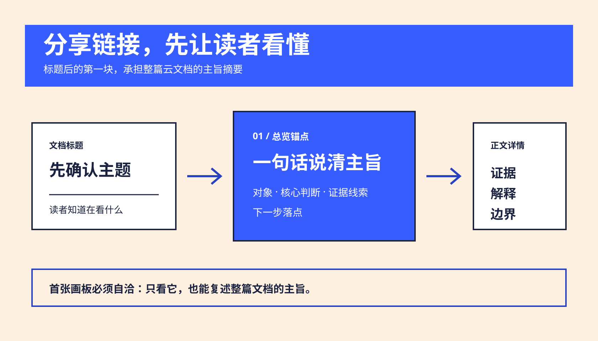
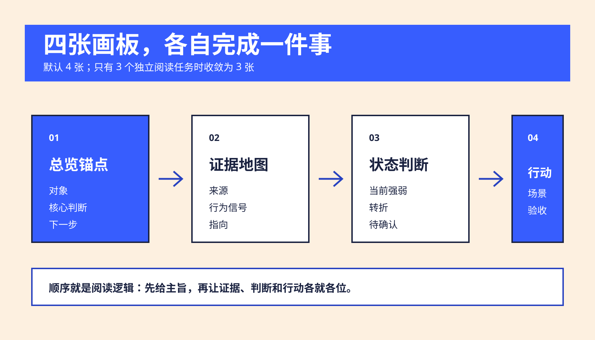
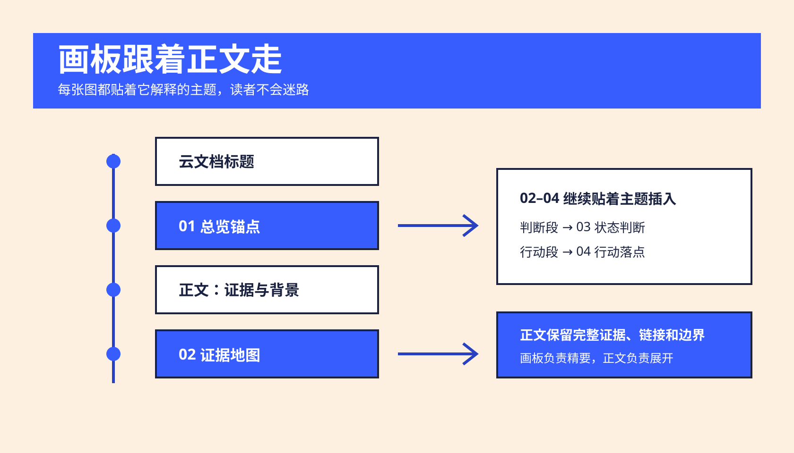
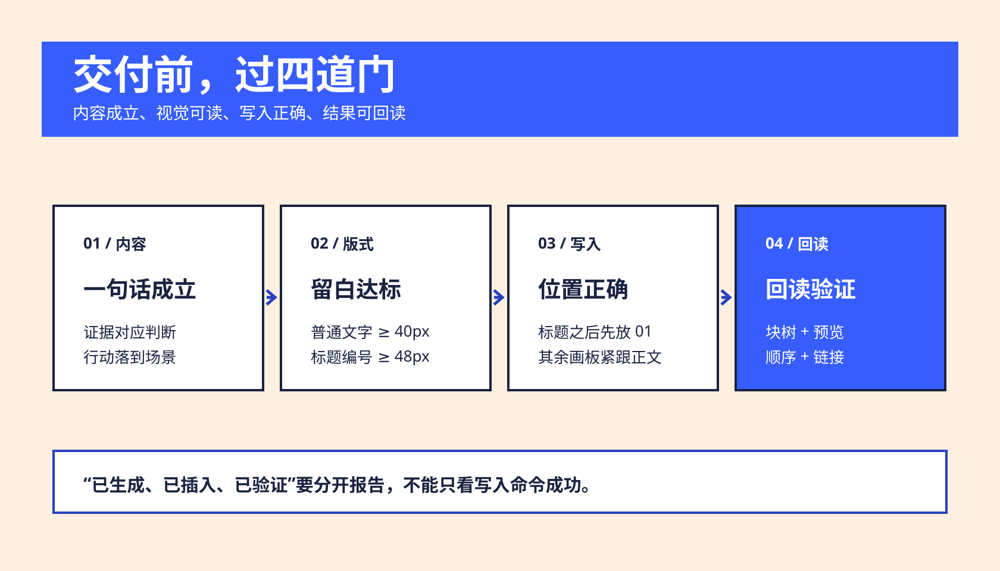

> “Good design makes a product understandable.” — Dieter Rams, [Ten Principles for Good Design](https://tenprinciples.design/)

# 大字报

<p align="center">
  
  
  
</p>

把结论、证据、状态和行动做成蓝米双色的高对比飞书画板；生成云文档时，默认用 4 张画板组织阅读顺序，第一张紧跟标题，承担分享链接的首屏摘要。

## 它解决什么问题

很多报告有完整内容，却没有一个能在分享链接打开后立即成立的入口。大字报把文档拆成清晰的视觉节奏：标题之后先给主旨，再把证据、判断和行动分别放回对应正文。

<p align="center">
  
</p>

## 云文档的默认四板结构

当输出目标是飞书云文档时，默认创建四张画板；材料只支撑三个独立阅读任务时使用三张。每张画板紧跟它所解释的正文段落，不把画板集中堆到文档末尾。

<p align="center">
  
</p>

| 顺序 | 画板任务 | 正文关系 |
| --- | --- | --- |
| 01 总览锚点 | 对象、核心判断、证据线索、下一步 | 标题后的第一个正文内容块 |
| 02 证据地图 | 证据从哪里来，指向什么 | 紧跟证据/材料部分 |
| 03 状态判断 | 当前强弱、关键转折、待确认边界 | 紧跟分析/状态部分 |
| 04 行动落点 | 真实场景、具体动作、验收触发 | 紧跟行动部分 |

## 画板如何回到正文

画板只承担精要表达，正文保留完整证据、来源链接、置信度和限制说明。第一张画板必须脱离“见下文”也能复述全文主旨；后续画板负责把读者带入每个主题的细节。

<p align="center">
  
</p>

## 视觉和质量门槛

- 蓝色 `#375dfe` 表达核心判断、重点证据或主行动；米色 `#fdf0e0` 承载画布和普通信息；深蓝 `#1a2240` 用于文字与边框。
- 普通卡片文字到边框内侧至少 40px；标题、编号和核心判断至少 48px；底部边界说明至少 24px。
- 对齐、对比、排列、亲密四项原则同时生效。四个同级元素使用等宽等高、同内边距、同基线的四列或 2×2；视觉重点通过颜色和字重表达，不能把第四项做小。
- 生成 SVG 后先本地渲染和检查，再写入飞书；写入后回读文档块顺序、画板数量、插入位置和预览结果。

<p align="center">
  
</p>

## 使用边界

大字报适合结论海报、诊断总览、状态盘点和行动摘要。流程、因果、依赖、架构、网络关系和时间线交给 [geometry-board](https://github.com/TongyiDai/geometry-board-skill)。飞书文档读写与画板插入交给对应的 `lark-doc` / `lark-whiteboard` 能力；本 Skill 负责内容压缩、构图和视觉规则。

## 面向 Agent

这份 Skill 面向能读取 Markdown、处理用户材料、生成 SVG 并按授权调用飞书能力的 Agent。执行时遵守以下最小契约：

- 先从输入提炼一个核心判断；没有可复述判断时先缩小范围。
- 单张画板交付 `SVG + 可选 PNG + 一句话构图说明`；画板保留结论，正文保留证据、来源、置信度和边界。
- 生成飞书云文档时默认创建 4 张画板：`总览锚点 → 证据地图 → 状态判断 → 行动落点`。第一张紧跟标题，作为标题后的第一个正文内容块。
- 写入前先检查 SVG；写入后回读文档块树、画板数量、插入位置、原始节点和预览结果。
- 使用授权的用户身份和对应飞书 Skill；能力或权限不足时报告“已生成 / 未插入”，保留源文件。

完整的触发条件、输入输出、四板契约、验证门槛和停止条件见 [AGENT-GUIDE.md](AGENT-GUIDE.md)。

## 快速调用

```text
Use $dazibao to turn this conclusion into a Feishu whiteboard poster.
Use $dazibao to turn this report into a Feishu document with four boards.
```

完整规则见 [SKILL.md](SKILL.md)，视觉 Token、构图配方、四板编排和留白门槛见 [references/visual-style.md](references/visual-style.md)。

## 许可证

MIT，见 [LICENSE](LICENSE)。
